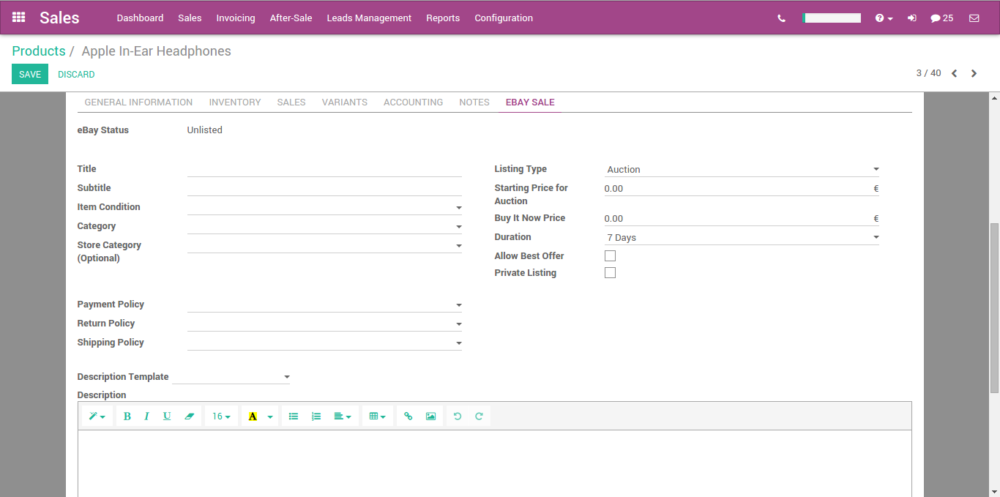
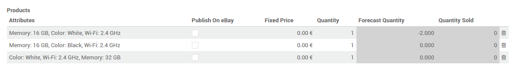

======================
How to list a product?
======================

Listing without variation
=========================

In order to list a product, you need to check the **use eBay** field on a product form. Then the eBay tab will be available.

If you check the **Use Stock Quantity** field, the quantity sets on eBay will be the Odoo **Forecast Quantity**.

The **Description Template** allows you to use templates for your listings. The default template does nothing except using the **eBay Description** field of the product. You can use html inside the **Description Template** and in the **eBay Descritpion**.

Listing with variations
=======================

When you check the **use eBay** on a product with variations and choose **Fixed Price** as **Listing Type**, the eBay form is sligthly different. In the variants array, you can choose which variant will be listed on eBay as well as set the price and the quantity for each variant.

