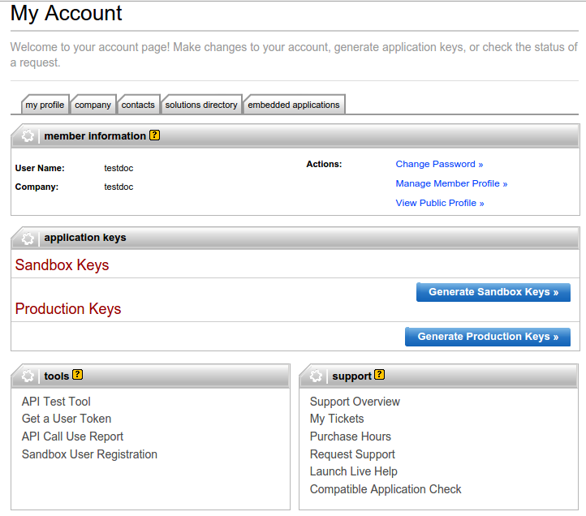

=====================
How to create tokens?
=====================

In order to create your tokens, you need to create a developer account `there <https://go.developer.ebay.com/>`_.
Once you're logged in, you can create Sandbox Keys and Production Keys by clicking on the adequate buttons.

After the creation of the keys, you can get the user token. To do so, click on the **Get a User Token** link in the bottom of the page. Go through the form, log in with you eBay account and you will get the keys and token needed to configure the module in Odoo.