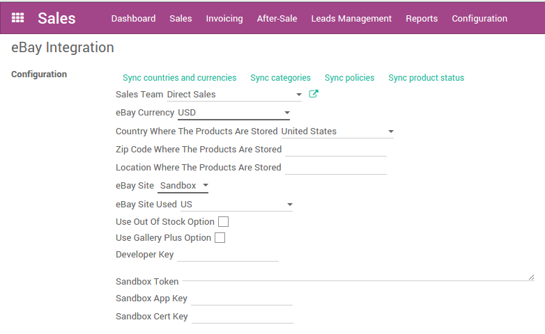

=============================
How to set up tokens in Odoo?
=============================

To set up the eBay integration, go to :menuselection:`Sales --> Configuration --> Settings`.

First choose if you want to use the production or the sandbox eBay Site. Then fill in the fields **Developer Key**, **Token**, **App Key**, **Cert Key**. Apply the changes.

Once the page is reloaded, you need to synchronize information from eBay. Push on **Sync countries and currencies**, then you can fill in all the other fields.

When all the fields are filled in, you can synchronize the categories and the policies by clicking on the adequate buttons.